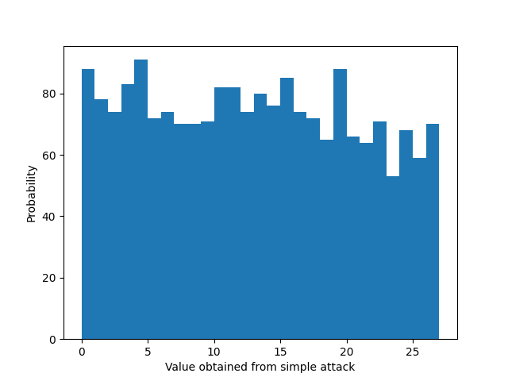

<p align="center">
  <!--  -->
  <h1 align="center">ACES</a></h1>
  <p align="center">A python library for the fully homomorphic encryption scheme ACES</p>
</p>

# Presentation

This package proposes an implementation for the ACES cryptosystem where we take the paramter $\omega = 1$, $N=1$ and $\mathsf{deg}(u) = n$. Details are available in the preprint <em>"Constructing a Fully Homomorphic Encryption Scheme with the Yoneda Lemma"</em>.

# Installation

At this time, the only way to install the package is to download its code and use it in your own code as follows.

```python
from aces import *
```

# Quickstart

To create an arithmetic channel $\mathsf{C} = (q,\omega,u)$, use the class ```ArithChannel```. The following snippet shows how to generate an arithmetic channel with $q=27$ and $\mathsf{deg}(u) = 10 = n$.
```python
>>> from aces import *
>>> ac = ArithChannel(27,10)
```
To generate the public key of a scheme with fully homomorphic properties, use the following instance:
```python
>>> (f0,f1,intmod,dim,u,tensor) = ac.publish(fhe = True)
```
To encrypt messages $m \in \mathbb{Z}_q$, use the class ```ACES``` as shown below.
```python
>>> bob = ACES(f0,f1,intmod,dim,u)
```
The encryption of the messages $3$ and $5$ is done as follows:
```python
>>> c_a = bob.encrypt(3)
>>> print(c_a[1])
[15]^9+[8]^8+[6]^7+[16]^6+[11]^5+[22]^4+[14]^3+[14]^2+[14]^1+[8]^0 (27)
>>> c_b = bob.encrypt(5)
>>> print(c_b[1])
[11]^9+[9]^8+[2]^7+[3]^6+[6]^5+[22]^4+[16]^3+[19]^2+[13]^1+[20]^0 (27)
```
To do arithmetic on encrypted information, use the class ```ACESAlgebra```. For example, we have:
```python
>>> alg = ACESAlgebra(intmod,dim,u,tensor)
>>> alice = ACESReader(ac.x,intmod,dim,u)
>>> alice.decrypt(alg.add(c_a,c_b))
8
>>> alice.decrypt(alg.mult(c_a,c_b))
15
```
A canonical attack for the ACES cryptosystem is the evaluation of the encryption polynomial at $\omega=1$. For most parameterizations, we can verify that this attack collects what empirically appears to be a random distribution.

```python
from aces import *

# Setup the cryptosystem parameters
ac = ArithChannel(27,10)
(f0,f1,intmod,dim,u,tensor) = ac.publish(fhe = True)
# Simulate two communicating parties
bob = ACES(f0,f1,intmod,dim,u)
alice = ACESReader(ac.x,intmod,dim,u)

# Compute the polynomial evaluations Enc(m)(omega) where omega=1
dist = []
m = 3
for i in range(2000):
  c = bob.encrypt(m)
  attack = sum(c[1].coefs) % intmod
  d = alice.decrypt(c)
  print(f"Enc({m})(omega) =",c[1],"attack:",attack,"[Sanity check] decrypted as",d)
  dist.append(attack)

plt.hist(dist, density=False, bins=range(intmod+1))
plt.ylabel('Probability')
plt.xlabel('Value obtained from simple attack')
plt.show()

```
 