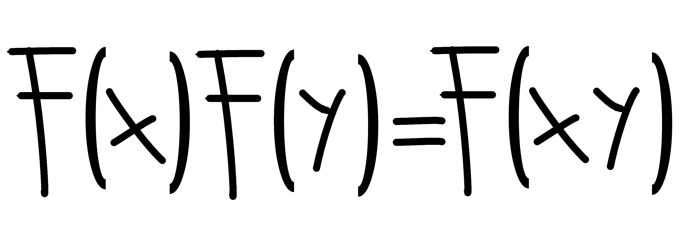

<p align="center">
  
  <h1 align="center">ACES</a></h1>
  <p align="center">A python library for the fully homomorphic encryption scheme ACES</p>
</p>

# Presentation

This package proposes an implementation for the ACES cryptosystem where we take the paramter $\omega = 1$, $N=1$ and $\mathsf{deg}(u) = n$. Details are available in the preprint  [<em>"Constructing a Fully Homomorphic Encryption Scheme with the Yoneda Lemma"</em>](https://arxiv.org/abs/2401.13255).

# Installation

At this time, the only way to install the package is to download its code and use it in your own code as follows.

```python
from aces import *
```

# &#9888; Important considerations &#x26A0;

ACES depends on the generation of an <em>arithmetic channel</em>, which is a quadruple $\mathsf{C} = (p,q,\omega,u)$ where $p$, $q$ and $\omega$ are three positive integers and $u$ is a polynomial in $\mathbb{Z}[X]$ for which the equation $u(\omega) = q$ holds in $\mathbb{Z}$. While the integer $\omega$ remains fixed at $1$, and the ACES library automatically generates the polynomial $u$, the user is still required to manually select the values for $p$ and $q$.

A quick skim through [section 5.1 of the research paper](https://arxiv.org/abs/2401.13255) already informs us that the condition $p^2 < q$ must hold for ACES to be valid.
The following sections address considerations to add to $p$ and $q$ if one intends to use the homomorphic properties of ACES. These sections also elucidate certain technical aspects, giving essential insights into the security considerations of ACES.

## Attacks on ACES

The security of ACES relies on two consecutive modulus operations, specifically involving the positive integers $q$ and $p$. The corresponding security principles are detailed in the subsequent subsections.

To begin, let us recall the notational conventions introduced in the paper:

$$\mathbb{Z}_q[X]_u = \mathbb{Z}_q[X] / u\mathbb{Z}_q[X]$$

Now, let us recall how a message $m \in \mathbb{Z}_p$ is encrypted as a cyphertext $(c,c')$. In general, the ciphertext is structured as follows:

1. The first component $c$ is an $n$-vector over $\mathbb{Z}_q[X]_u$ given by $c = f_0^Tb$, where:
    - $f_0$ is an $n \times N$ matrix over $\mathbb{Z}_q[X]_u$ (chosen during key generation).
    - $b$ is an $N$-vector over $\mathbb{Z}_q[X]_u$ (selected by the sender).

2. The second component $c'$ is an element of $\mathbb{Z}_q[X]$ defined as $c' = r_m + c^Tx + e$, where:
    - $r_m$ is an element over $\mathbb{Z}_q[X]_u$ chosen such that its evaluation in $\mathbb{Z}_q$ at the integer $\omega$ equals $m$ (chosen by the sender).
    - $x$ is an $n$-vector over $\mathbb{Z}_q[X]_u$ (considered the private key).
    - $e$ is a scalar product in the form of $b^Te'$, where $e'$ is an $N$-vector over $\mathbb{Z}_q[X]_u$ such that the evaluations of $e$ and $e'$ in $\mathbb{Z}_q$ at the integer $\omega$ are multiples of $p$ (chosen by the sender).


### Attacking the public key

Given that the public key takes the form $(f_0, f_1)$ with $f_1 = f_0^Tx + e'$, it is reasonable to assume that an attacker's objective might involve deducing the value of $x$ by eliminating $e$ and solving a problem akin to Gaussian elimination.

To eliminate $e'$, the attacker is likely to exploit the existence of $k_0$ and $k_1$ satisfying the equation:

$$e'(\omega) - qk_0 = k_1p$$

It is noteworthy that the probability of $k_0$ being non-zero is high, given that the coefficients of the polynomial $e'$ are as likely to be small as they are to be large in $\mathbb{Z}_q$. In this context, embedding the equation $f_1(\omega) = f_0(\omega)^Tx(\omega) + e'(\omega)$ into $\mathbb{Z}_q$ is equivalent to expressing it in $\mathbb{Z}$ as:

$$f_1(\omega) = f_0(\omega)^Tx(\omega) + k_1p + qk_0$$

Applying a modulus $p$ to this equation yields the relation:

$$f_1(\omega)\,(\mathsf{mod}\,p) = \Big(f_0(\omega)^Tx(\omega) + qk_0\Big)\,(\mathsf{mod}\,p)$$

If we choose $p$ and $q$ to be coprime, then the "randomness" of the term $qk_0$ is entirely governed by the "randomness" of $k_0$. Consequently, the construction of $k_0$ from $e'$ implies that the randomness of $k_0$ is contingent on the randomness of the coefficients of the polynomial $e'$.

>[!NOTE]
>The paper ["Provably Weak Instances of Ring-LWE Revisited"](https://eprint.iacr.org/2016/239.pdf) provides examples where an attack on the presented version of RLWE (PLWE) is feasible due to the condition $u(1) = 0$ in $\mathbb{Z}_q$. It is crucial to note that this vulnerability is observed in cases where $q$ is small, and the error term $e'$ tends to exhibit a distribution closer to Gaussian than uniform. It is important to emphasize that this scenario is distinct from the context considered in ACES.
>
>In the context of ACES, the security is upheld by the hardness of the Learning With Errors (LWE) problem on both integers and polynomials, ensuring robustness against potential attacks.
>

### Cyphertext 

Given that a ciphertext is structured as $(f_0^Tb, r_m + b^Tf_1)$, where $f_1 = f_0^Tx + e'$ is known to all parties, it is plausible to assume that an attacker may aim to derive $b$ by eliminating $f_0$ (also known to all parties) and solving what resembles a linear equation.

To eliminate $f_0$ from the expression $c' = f_0^Tb$, the attacker might exploit scenarios where $N$ is small, reducing the hyperplane's dimension (given by the equation $c' = f_0^Tb$) in which $b$ exists.

<em>In our case, with $N=1$, an attacker could attempt to divide a component of $c'$ by the corresponding component of $f_0$ to recover $b$.</em>

To thwart this, we observe that $q$ need not be prime. Consequently, $\mathbb{Z}_q$ is not a field and contains various divisors of zero. Choosing $f_0 = (f_{0,1}, \dots, f_{0,n})$ such that all its components $f_{0,i}$ have coefficients that are zero divisors guarantees that an ideal of polynomials $e^{\prime\prime}$ satisfying the equation $c' = f_0^T(b + e^{\prime\prime})$ exists.

The attacker may also evaluate the product $f_0^Tb$ in $\mathbb{Z}_q$ at some element $\tau$. If the attacker can invert a component of $f_0^T(\tau)$, then they can recover $b(\tau)$. However, using $b(\tau)$ to solve the equation

$$f_1(\tau) = r_m(\tau) + b(\tau)^Tf_1(\tau)$$

would only yield $r_m(\tau) = f_1(\tau) - b(\tau)^Tf_1(\tau)$, likely to appear random to an attacker unless $\tau = \omega$. To safeguard ACES, we choose $f_0$ such that its evaluation $f_0(\omega)$ is an $n$-vector of zero divisors in $\mathbb{Z}_q$.

The discussion above suggests that, for an implementation of ACES with $\omega=1$ and $N=1$, we want to take $n = \mathsf{deg}(u) > 2$ to be even and construct $f_0$ as follows, where all elements $a_{i,j}$ can be randomly chosen from the zero divisors in $\mathbb{Z}_q$:

$$f_{0,i} = \sum_{j=1}^{\lfloor (n-1)/2\rfloor} a_{i,j}X^j + \Big(\big(a_{i,0} - \sum_{j=1}^{n-1} a_{i,j}\big)\,(\mathsf{mod}\,q)\Big)X^{n/2} + \sum_{j=n/2+1}^{n-1} a_{i,j}X^j$$

In conclusion, by choosing $q$ divisible by a non-trivial set of prime numbers, the attacker faces the challenge of finding the representative $b$ up to an ideal of polynomials. Additionally, if $f_0$ is composed of non-invertible coefficients, the same applies to $f_0(\omega)$.


### Noise on messages

The noise $r$ influencing the message $m$ is encoded through the selection, made solely by the sender $\mathsf{Bob}$, of $n$ random coefficients $a_0, a_1, \dots, a_{n-1}$ in $\mathbb{Z}_q$. This encoding follows the formula:

$$r(m) = \Big(\big(m - \sum_{i=0}^{n-1} a_i\big)\,(\mathsf{mod}\,q)\Big)X^0 + \sum_{i=0}^{n-1} a_iX^i$$

Evaluating the representative polynomial for $r(m)$ at $\omega=1$ in $\mathbb{Z}$ and sending that value to $\mathbb{Z}_q$ yields the equation $r(m)(1) = m$ in $\mathbb{Z}_q$. However, the same evaluation sent to $\mathbb{Z}_p$ results in the formula:

$$r(m)(1) = \Big(m - \sum_{i=1}^{n-1}a_i\Big)\,(\mathsf{mod}\,q) + \sum_{i=1}^{n-1}a_i \quad\quad (\mathsf{mod}\,p)$$

When $\mathsf{Bob}$ selects $a_0, a_1, \dots, a_{n-1}$ such that the inequality 

$$m < \sum_{i=1}^{n-1}a_i < q$$

holds in $\mathbb{Z}$, the term 

$$m - \sum^{n-1}_{i=1} a_i$$

will be outside the interval $[0, q-1]$, introducing an additional term $qk_0$ to the expression $r(m)(1)$ in $\mathbb{Z}_p$. Consequently, we establish the equivalence:

$$r(m)(1) \equiv m + qk_0 \,(\mathsf{mod}\,p)$$

Selecting coprime $p$ and $q$ ensures that the "randomness" of the term $qk_0$ is entirely determined by the "randomness" of $k_0$, which, in turn, is influenced by the randomness of the elements $a_0, a_1, \dots, a_{n-1}$.

### Vanishing noise
Recall that the noise $e$ is constructed as the product $b\cdot e'$ of two polynomials $b$ and $e'$ within the polynomial ring:

$$\mathbb{Z}_q[X]_u = \mathbb{Z}_q[X] / u\mathbb{Z}_q[X]$$

To elaborate, the polynomial $e'$ is determined by the sender $\mathsf{Bob}$ through the selection of $n$ random coefficients $a_0, a_1, \dots, a_{n-1}$ in $\mathbb{Z}_q$ and one random element $\delta_0 \in \lbrace 0,1\rbrace$ with the following conditions:
- The equation $\delta_0 = 0$ holds with probability $\mathbb{P}_0$.
- The expression for $e'$ is given by:
$$e' = \Big(\big(p \delta_0 - \sum_{i=0}^{n-1} a_i\big)\,(\mathsf{mod}\,q)\Big)X^0 + \sum_{i=0}^{n-1} a_iX^i$$

Subsequently, the polynomial $b$ is determined by $\mathsf{Bob}$ through the selection of $n$ random coefficients $b_0, b_1, \dots, b_{n-1}$ in $\mathbb{Z}_q$ and one random element $\delta_1 \in \lbrace 0,1,\dots,p\rbrace$ with the formula:
$$b = \Big(\big(\delta_1 - \sum_{i=0}^{n-1} b_i\big)\,(\mathsf{mod}\,q)\Big)X^0 + \sum_{i=1}^{n-1} b_iX^i$$

With these selections, evaluating the polynomial $e$ in $\mathbb{Z}_q$ at the element $\omega = 1$ yields the following relations when sent to $\mathbb{Z}_q$ (considering $p^2 < q$):

$$e(1) = p \delta_0 \cdot \delta_1 \in \lbrace 0, p, 2p, \dots, p^2 \rbrace$$

Since $\delta_1$ is chosen uniformly and $\delta_0$ is chosen to be $\delta_0 = 0$ with probability $\mathbb{P}_0$, the value $e(1)$ in $\mathbb{Z}_q$ can be seen as randomly chosen from $\lbrace 0, p, 2p, \dots, p^2 \rbrace$ with the following probabilities:

$$\mathbb{P}(e(1) = 0) = \sum_{i=1}^{p+1} \mathbb{P}_0\frac{1}{p+1} + (1-\mathbb{P}_0)\frac{1}{p+1} = \frac{\mathbb{P}_0p+1}{p+1}$$

$$\mathbb{P}(e(1) = kp~|~k \neq 0) = (1-\mathbb{P}_0) \frac{1}{p+1} = \frac{1-\mathbb{P}_0}{p+1}$$

However, the evaluation $e(1)$ directly sent to $\mathbb{Z}_p$ will appear uniformly distributed in $\mathbb{Z}_p$. Specifically, the coefficients 

$$\big(p \delta_0 - \sum_{i=0}^{n-1} a_i\big)\,(\mathsf{mod}\,q) \quad\quad\quad\quad \big(\delta_1 - \sum_{i=0}^{n-1} b_i\big)\,(\mathsf{mod}\,q)$$

in the expressions of $e'$ and $b$ may introduce additional terms $qk_0$ and $qk_0'$ to the expressions of $e'(1)$ and $b(1)$, respectively. In other words, we would have

$$e(1) \equiv (p \delta_0+ qk_0)(\delta_1 + qk_0') \,(\mathsf{mod}\,p)$$

Selecting coprime $p$ and $q$ ensures that the "randomness" of the terms $qk_0$ and $qk_0'$ is entirely determined by the "randomness" of $k_0$ and $k_0'$, respectively, which are influenced by the randomness of the elements $a_0, a_1, \dots, a_{n-1}$ and $b_0, b_1, \dots, b_{n-1}$.

## Homomorphism and how it works

While the decryption in ACES operates within the ring $\mathbb{Z}$, it is essential to recognize that the homomorphic structure is established within the polynomial ring $\mathbb{Z}[X]$. In drawing a parallel, consider this process akin to employing complex numbers for computations that might pose greater challenges when exclusively using real numbers, such as solving polynomials or analyzing signals.

Specifically, if we let $x = (x_1,\dots,x_n)$ denote the private key for ACES, then the homomorphism property relies on a 3-tensor $\lambda = (\lambda_{i,j}^k)_{i,j,k}$ satisfying the following relation for every triple $(i,j,k)$ of elements in $\lbrace 0,1,2,\dots,n\rbrace$.

$$x_i \cdot x_j = \sum_{i,j} \lambda_{i,j}^k x_k$$

If we tried to imagine what this equation would amount to in the context of complex numbers, we would be faced with the challenge of finding real numbers $\lambda_1$ and $\lambda_2$ for which equations of the following form holds.

$$(a_1+ib_1)(a_2+ib_2) = \lambda_1 \cdot (a_1+ib_1) + \lambda_2 \cdot (a_2+ib_2)$$

By uniqueness of the complex and real parts, we would then obtain:
- $\lambda_1 a_1 + \lambda_2 a_2 = a_1a_2-b_1b_2$
- $\lambda_1 b_1 + \lambda_2 b_2 = a_1b_2+a_2b_1$

Note that without the complex structure, deducing the values of $\lambda_1$ and $\lambda_2$ would be challenging. This underscores how $\mathbb{C}$ introduces a mathematical structure that cannot be recovered by $\mathbb{R}$. In a parallel manner, we leverage the polynomial ring $\mathbb{Z}[X]$ to encapsulate the homomorphic properties of ACES. After performing arithmetic operations on polynomials to compute homomorphic sums and products, we can seamlessly revert to $\mathbb{Z}$ for decrypting the encrypted data.

### Cost of homomorphism

ACES is a fully homomorphic encryption scheme that initially relies on a leveled FHE framework. This framework is then equipped with a refresh operation $\mathsf{refr}$ designed to mitigate the level increase resulting from arithmetic operations. In this section, we explore the conditions that must be satisfied by the parameters $p$ and $q$ to leverage the homomorphism property.

For two ciphertexts $(c_1, c_1') \in S_{\mathsf{C},k_1}(m_1)$ and $(c_2, c_2') \in S_{\mathsf{C},k_2}(m_2)$ with respective levels $k_1$ and $k_2$, the homomorphic sum of these ciphertexts can be computed if the inequality shown below on the left holds:

$$k_1 + k_2 < \frac{q}{p} \quad\quad\quad\Rightarrow\quad\quad\quad (c_1, c_1') \oplus (c_2, c_2') \in S_{\mathsf{C}, k_1 + k_2}(m_1 + m_2)$$

Similarly, for a suited parameter $\lambda$ (refer to [the paper in section 5.2](https://arxiv.org/abs/2401.13255)), the homomorphic product of the ciphertexts $(c_1, c_1')$ and $(c_2, c_2')$ is achievable if the inequality shown below on the left holds:

$$k_1 k_2 p < \frac{q}{p} \quad\quad\quad\Rightarrow\quad\quad\quad (c_1, c_1') \otimes_{\lambda} (c_2, c_2') \in S_{\mathsf{C}, k_1 k_2 p}(m_1 m_2)$$

Furthermore, given that any encryption $(c, c')$ produced through ACES is constrained by an upper bound represented by the integer $p$, we can derive an estimate for $q$ in terms of $p$ to ensure the system's capability to perform homomorphic additions and multiplications. To elaborate further, starting with ciphertexts generated by ACES, a multiplication operation results in a level of $p^3$, whereas an addition operation yields a level of $2p$. Consequently, a combination of additions and multiplications in the form:

$$x_1 \cdot y_1 + x_2 \cdot y_2 + \dots + x_h \cdot y_h$$

will produce a ciphertext with a level in $O(p^3)$. Thus, using approximately $K$ layers of such combinations leads to a ciphertext with a level in $O(p^{3\cdot 2^{K-1}}p^{2^{K-1}-1})$. Considering our desire for this level to be significantly less than $q/p$, the following inequality should be satisfied for the use of around $K$ layers of additions and multiplications:

$$K_0 p^{2^{K+1}} \ll q$$

### Chinese Remainder Theorem

The existence of the 3-tensor $\lambda$ facilitating homomorphic multiplications in ciphertexts stems from the quotient of the ring $\mathbb{Z}_q[X]$ by the polynomial ideal generated by $u$. Consequently, the parameter $u$ plays a crucial role in our system. However, this parameter introduces a potential vulnerability, as an attacker might attempt to glean information about the private key through it.

First, note that we can always choose the coefficient of $u$ from the interval $[0, q-1]$, allowing $u$ to represent itself in the polynomial rings $\mathbb{Z}_q[X]$ and $\mathbb{Z}[X]$. Let $\omega_1, \omega_2, \dots, \omega_{\rho}$ denote the distinct roots of $u$ in $\mathbb{C}$ when $u$ is treated as a polynomial in $\mathbb{Z}[X]$. Given the equation $u(\omega_i) = 0$ for all $i \in \lbrace 1,2,\dots,\rho \rbrace$, we have the following expression in $\mathbb{C}$:

$$c'(\omega_k) = r(m)(\omega_k) + c(\omega_k)^Tx(\omega_k) + e(\omega_k) + qk_{0}$$

Decomposing the polynomials $r(m)$ and $e$ yields the following formula, where $a_i$ and $a_i'$ are coefficients to be determined:

$$c'(\omega_k) = m + \sum_{i=1}^{n-1} a_i\big(\omega_k^i - 1\big) + c(\omega_k)^Tx(\omega_k) + p \delta + \sum_{i=1}^{n-1} a_i'\big(\omega_k^i - 1\big) + qk_{0}$$

This equation implies that we are attempting to solve a system of $\rho$ linear equations with $3n$ unknown variables:

$$(m,a_1, a_2, \dots, a_{n-1}, x_1(\omega_k), \dots, x_n(\omega_k), a_1', a_2', \dots, a_{n-1}', k_{0})$$

Considering that $\rho \leq \mathsf{degree}(u) = n < n + 2n$, inferring $a_i$ and $a_i'$ using this method may prove to be a complex task. This complexity increases further with higher values of $n$.

## Take away

Throughout the preceding sections, it became evident that users must adhere to the following requirements when selecting values for $p$, $q$ and $n$:

- we should have $p^2 < q$
- $p$ and $q$ should be coprime
- to process at least $K$ layers of operations, we should have $K_0 p^{2^{K+1}} \ll q$ for some constant $K_0$.
- the integer $q$ should not be prime
- take $n = \mathsf{deg}(u) > 2$ to be even

In light of this, users are advised to consider using a formula as follows, where $t \geq 2$, $K_0 \geq 1$, $K_1 \geq 1$ and $K \geq 1$:

$$q = K_0 \cdot (p^{t^K} + K_1)$$

For example, if we take $p = 2^5 = 32$ and $q = 32^5+1$, then we have the following factorization:

$$q = 3 \cdot 11 \cdot 4051 \cdot 251$$

# Quickstart

To create an arithmetic channel $\mathsf{C} = (p,q,\omega,u)$, use the class ```ArithChannel```. The following snippet shows how to generate an arithmetic channel with $p=2^5$, $q=p^{2^2+1}+1$ and $\mathsf{deg}(u) = 10 = n$.
```python
>>> from aces import *
>>> ac = ArithChannel(32,32**5+1,10)
```
To generate the public key of a scheme with fully homomorphic properties, use the following instance:
```python
>>> (f0,f1,vanmod,intmod,dim,u,tensor) = ac.publish(fhe = True)
```
Below, we will access the private key $x$ via the property ```ac.x```. It is important to note that the integers $p$ and $q$ used for initializing the arithmetic channel ```ac``` must satisfy the relationships $p^2 < q$ and $\mathsf{gcd}(p, q) = 1$. In cases where these conditions are not met, the class ```ArithChannel``` will generate a new value for $q$ as $p^2 + 1$.

As elaborated in the research paper and the preceding section, the homomorphism property imposes an upper limit on the maximum achievable level. This limit is determined by the ratio $q/p$, and it can be calculated as shown below:
```python
>>> q_p = intmod/vanmod
>>> q_p
1048576.03125
```
To encrypt messages $m \in \mathbb{Z}_p$, use the class ```ACES``` as shown below.
```python
>>> bob = ACES(f0,f1,vanmod,intmod,dim,u)
```
The following example illustrates an encryption of the message $m=3$. The encryption algorithm outputs a ciphertext $(c,c')$ and its associated level $k = \mathsf{lvl}(c,c')$. We also display the polynomials
 - $121075X^9+5649435X^8 + \dots + 27465466$
 - $\vdots$
 - $30386758X^9+1334087X^8+\dots+22929201$

encoding the component $c \in \mathbb{Z}_q[X]_u^{(n)}$ and the polynomial 
$$30858957 X^9 + 16000274X^8 + \dots + 10597696$$
 encoding the component $c'$.
```python
>>> enc3, k3 = bob.encrypt(3)
>>> k3
25
>>> for d in enc3.dec:
...   d
...
[121075]^9+[5649435]^8+[5542690]^7+[14958192]^6+[16633046]^5+[5752935]^4+[32058503]^3+[5293923]^2+[18369355]^1+[27465466]^0 (33554433)
[18906160]^9+[28450783]^8+[1252824]^7+[7240491]^6+[24739779]^5+[32308428]^4+[28997005]^3+[13389054]^2+[24847231]^1+[12218266]^0 (33554433)
[31642720]^9+[17571123]^8+[7802115]^7+[20975900]^6+[18059036]^5+[27206897]^4+[7646492]^3+[17520606]^2+[11916943]^1+[32832592]^0 (33554433)
[26659922]^9+[33468059]^8+[17328982]^7+[23805389]^6+[25986207]^5+[4849333]^4+[28520167]^3+[10346909]^2+[10528849]^1+[13562833]^0 (33554433)
[12781113]^9+[11709032]^8+[29584032]^7+[18934336]^6+[1928972]^5+[20108424]^4+[14288471]^3+[24889523]^2+[32069637]^1+[3938769]^0 (33554433)
[29414002]^9+[1811144]^8+[1812381]^7+[13446670]^6+[9612938]^5+[29449076]^4+[31582116]^3+[17010892]^2+[24900786]^1+[15700399]^0 (33554433)
[28032548]^9+[22796430]^8+[16578017]^7+[2237949]^6+[6057810]^5+[10110573]^4+[8300098]^3+[17247065]^2+[2393445]^1+[32204355]^0 (33554433)
[13515642]^9+[13363664]^8+[25893303]^7+[4926840]^6+[669429]^5+[33455708]^4+[26999500]^3+[18775791]^2+[17413601]^1+[31147910]^0 (33554433)
[12681589]^9+[25515785]^8+[4479808]^7+[6719771]^6+[24784773]^5+[9965881]^4+[4853479]^3+[4430585]^2+[15484093]^1+[30043444]^0 (33554433)
[30386758]^9+[1334087]^8+[13182905]^7+[22497842]^6+[11468608]^5+[30778504]^4+[14289470]^3+[4535485]^2+[640217]^1+[22929201]^0 (33554433)
>>> enc3.enc
[30858957]^9+[16000274]^8+[4107970]^7+[3680330]^6+[20018614]^5+[24108761]^4+[22777245]^3+[872955]^2+[15601690]^1+[10597696]^0 (33554433)
>>> enc3.uplvl
32
```
In the preceding example, the integer ```k3``` represents the minimal encryption level of $(c,c')$, while the integer ```enc3.uplvl``` represents an upper bound on the level of $(c,c')$ known to all parties, including $\mathsf{Alice}$, $\mathsf{Bob}$, and $\mathsf{Carol}$. It is crucial to emphasize that in practical scenarios, the integer ```k3``` should remain confidential, and only its theoretical upper bound ```enc3.uplvl``` is deemed safe to share. In fact, it is strongly recommended to retain only an integer $0 \leq k' \leq$```k3``` and securely erase the memory of ```k3``` from the computer.

Given that $\mathsf{lvl}(c,c') = 25$, the encryption $(c,c')$ of $m=3$ falls within the following sets:

$$S_{\mathsf{C},25}(m) \subseteq S_{\mathsf{C},32}(m)$$

To decrypt an encrypted message, use the ```ACESReader``` class. The following example demonstrates how to decrypt the ciphertext ```enc3```. As expected, we retrieve the message $m=3$.
```python
>>> alice = ACESReader(ac.x,vanmod,intmod,dim,u)
>>> alice.decrypt(enc3)
3
```
To do arithmetic on encrypted information, use the class ```ACESAlgebra```. The following example shows how to recover the homomorphism properties:

$$\mathsf{Dec}(\mathsf{Enc}(3) + \mathsf{Enc}(5)) = 5+3\quad\quad\mathsf{Dec}(\mathsf{Enc}(3) \cdot \mathsf{Enc}(5)) = 5 \cdot 3$$

```python
>>> alg = ACESAlgebra(vanmod,intmod,dim,u,tensor)
>>> enc5, k5 = bob.encrypt(5)
>>> alice.decrypt(alg.add(enc3,enc5))
8
>>> alice.decrypt(alg.mult(enc3,enc5))
15
```

# FHE protocol

Now that we have explored the features of the leveled FHE underlying ACES, let us illustrate the FHE protocol described in [section 5.3 of the research paper](https://arxiv.org/abs/2401.13255). Specifically, we want to consider a list ```array``` of data and its encryption through ACES. We can illustrate this with the following lines of code.
```python
>>> import random as rd
>>> array = [rd.randint(0,5) for _ in range(8)]
>>> enc_array = [bob.encrypt(a) for a in array]
```
As seen earlier, the algorithm ```bob.encrypt()``` returns the cyphertext and its associated level. Since we cannot share levels, we want to separate them as follows.
```python
>>> send_array, keep_array = map(list,zip(*enc_array))
```
We now have the following data:
```python
>>> array
[0, 2, 5, 5, 0, 1, 3, 3]
>>> send_array
[<aces.ACESCipher object at 0x7f63de8ed970>, <aces.ACESCipher object at 0x7f63de8edd30>, <aces.ACESCipher object at 0x7f63de900a60>, <aces.ACESCipher object at 0x7f63de9006a0>, <aces.ACESCipher object at 0x7f63de90f130>, <aces.ACESCipher object at 0x7f63de9006d0>, <aces.ACESCipher object at 0x7f63de90fa30>, <aces.ACESCipher object at 0x7f63de9000a0>]
>>> keep_array
[9, 0, 8, 0, 0, 0, 15, 0]
```
Note that the list ```keep_array``` contains a considerable number of zero values, potentially posing a concern if an attacker were aware of our level distribution biased towards 0. While a non-negligeable portion of LWE-based cryptosystems utilize a Gaussian distribution and are centered at a specific value, ACES offers the flexibility to recalibrate the distribution of levels using the formulas from [Vanishing noise](#vanishing-noise). However, this adjustment increases the likelihood of the refresh operation being needed sooner to access the full homomorphic property of ACES compared to scenarios where more zero values are present.

In our specific case, let us consider the scenario where $\mathsf{Bob}$ desires greater randomness in the levels of the ciphertexts. The ```ACES``` class provides the capability to incorporate the probability $\mathbb{P}_0$, as introduced in [Vanishing noise](#vanishing-noise), as an input parameter. In the forthcoming example, we set $\mathbb{P}_0 = 0.01$ to achieve an almost uniform distribution of levels within the set $\lbrace 0,1,2,\dots,p\rbrace$.
```python
>>> bob = ACES(f0,f1,vanmod,intmod,dim,u,0.01)
>>> array = [rd.randint(0,5) for _ in range(8)]
>>> enc_array = [bob.encrypt(a) for a in array]
```
Notice the disparity in the distribution of values within the ```keep_array``` list below.
```python
>>> send_array, keep_array = map(list,zip(*enc_array))
>>> array
[2, 3, 5, 0, 4, 2, 4, 2]
>>> send_array
[<aces.ACESCipher object at 0x7f6407739f70>, <aces.ACESCipher object at 0x7f63de900940>, <aces.ACESCipher object at 0x7f63de9001f0>, <aces.ACESCipher object at 0x7f63de89ef10>, <aces.ACESCipher object at 0x7f63de89e730>, <aces.ACESCipher object at 0x7f63de9074c0>, <aces.ACESCipher object at 0x7f63de8a7bb0>, <aces.ACESCipher object at 0x7f63de8b7c10>]
>>> keep_array
[16, 27, 1, 8, 17, 11, 8, 25]
```
To simular an FHE protocol, let us suppose that $\mathsf{Alice}$ has sent the encrypted data ```send_array``` on a remote server and consider a scenario where an algoritm of additions and multiplications as shown below runs on the encrypted data.

$$F:(x_0,x_1,x_2,\dots,x_7) \mapsto (x_0 \cdot x_1 + x_2 \cdot x_3 + x_4 \cdot x_5) \cdot x_6 + x_7$$

We will define this algorithm on the non-encrypted data ```array``` (as a sanity check), on the list of encrypted data ```send_array``` and on the list of levels ```keep_array``` as instructed in [section 5.3 of the research paper](https://arxiv.org/abs/2401.13255).
```python
>>> def true_fun(a):
...  return (a[0] * a[1] + a[2] * a[3] + a[4] * a[5]) * a[6] + a[7]
...
>>> def send_fun(a):
...  return alg.add( alg.mult( alg.add( alg.add( alg.mult(a[0],a[1]) , alg.mult(a[2],a[3])) , alg.mult(a[4],a[5])) , a[6]) , a[7])
...
>>> def keep_fun(a):
...  return alg.addlvl( alg.multlvl( alg.addlvl( alg.addlvl( alg.multlvl(a[0],a[1]) , alg.multlvl(a[2],a[3])) , alg.multlvl(a[4],a[5])) , a[6]) , a[7])
...
```
First, let us see what the algorithm is meant to output for the values in ```array```:
```python
>>> truth = true_fun(array)
>>> truth % 32
26
```
Now, let us shift our focus to the server side. To recap, we previously set $q = p^{2^2+1}+1$, implying that ```ACESAlgebra``` can likely accommodate only a single layer of a sum of multiplications. However, the ```send_fun``` function incorporates two such layers. In this specific case, it becomes apparent that this configuration is sufficient to surpass the levels beyond $q/p$, resulting in a failure of the leveled FHE procedure, as demonstrated below.
```python
>>> online = send_fun(send_array)
>>> online.uplvl
100663328
>>> q_p - online.uplvl
-99614751.96875
>>> alice.decrypt(online)
21
```
As elucidated in [Section 5.3 of the research paper](https://arxiv.org/abs/2401.13255), it is necessary to decompose the algorithm $F$ into smaller layers, namely $F_1$ and $F_2$. For instance, the definition of $F_1$ is presented below.
```python
>>> def true_fun1(a):
...  return a[0] * a[1] + a[2] * a[3] + a[4] * a[5]
...
>>> def send_fun1(a):
...  return alg.add( alg.add( alg.mult(a[0],a[1]) , alg.mult(a[2],a[3])) , alg.mult(a[4],a[5]))
...
>>> def keep_fun1(a):
...  return alg.addlvl( alg.addlvl( alg.multlvl(a[0],a[1]) , alg.multlvl(a[2],a[3])) , alg.multlvl(a[4],a[5]))
```
When we apply $F_1$ to the corresponding ciphertexts, the leveled homomorphism proves to be successful, as evidenced below.
```python
>>> truth1 = true_fun1(array[:6])
>>> truth1 % 32
14
>>> online1 = send_fun1(send_array[:6])
>>> online1.uplvl
98304
>>> q_p - online1.uplvl
950272.03125
>>> alice.decrypt(online1)
14
```
Subsequently, we can calculate the equivalent of $F_1$ on the corresponding levels using ```keep_fun1```. In practice, the resulting output level ```k1``` (or in fact any positive integer less than ```k1```) is transmitted to the server, while maintaining the secrecy of the levels in ```keep_array```. Then, the server uses the integer ```k1``` to refresh the ciphertext ```online1```.
```python
>>> k1 = keep_fun1(keep_array[:6])
>>> c1 = alg.refresh(online1,k1)
>>> c1.uplvl
78240
>>> alice.decrypt(c1)
14
```
As can be seen above, the refresh operation does not impact the message associated with the ciphertext; rather, it diminishes the upper bound level ```c1.uplvl```. While this reduction may appear trivial when compared to the earlier value of ```online1.uplvl```, the refresh operation nevertheless remains efficient in revitalizing the ciphertext.

To confirm the success of this refresh operation, we can now proceed to compute the second layer of the algorithm $F$. First, let us define the function $F_2$ associated with this the second layer.
```python
>>> def true_fun2(a):
...  return a[0] * a[1] + a[2]
...
>>> def send_fun2(a):
...  return alg.add( alg.mult(a[0],a[1]) , a[2])
...
>>> def keep_fun2(a):
...  return alg.addlvl( alg.multlvl(a[0],a[1]) , a[2])
...
```
If we now combine this second layer with the output of the refresh operation, we can validate that the computed ciphertext accurately recovers the true value of the computation.
```python
>>> truth2 = true_fun2([truth1] + array[6:])
>>> truth2 % 32
26
>>> online2 = send_fun2([c1] + send_array[6:])
>>> online2.uplvl
80117792
>>> q_p - online2.uplvl
-79069215.96875
>>> alice.decrypt(online2)
26
```
A limitation in our presentation was that our algorithm struggled to handle numerous layers of additions and multiplications. Although this might restrict the volume of information processed simultaneously, we could enhance the level range by setting $p=2$ and $q = 2^{2^5+5}+1 = 137438953473$.
